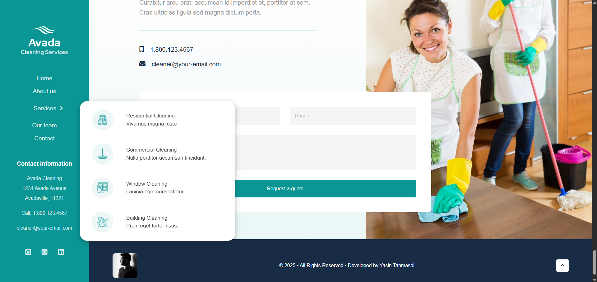

# Avada Cleaning Services

A practice project inspired by the design of Avada Cleaning Services website, built using only HTML and CSS.

🔗 [Live Demo](https://yasin-tahmasbi.github.io/avada-cleaning-services/)

## ✨ Project Overview

🌟 **Clean Desktop Landing Page**

A polished, desktop-focused landing page built purely with HTML and CSS, inspired by Avada Cleaning Services. Emphasis on a structured layout, readable typography, and user-focused design.

🛠 **Organized & Maintainable Code**

HTML is structured semantically, and CSS is modularized using variables for colors and reusable styles, ensuring maintainability and scalability.

⚡ **Performance-Driven Approach**

Optimized assets and carefully structured markup ensure fast load times and a smooth desktop experience.

🎯 **Learning-Focused Project**

Built as a hands-on exercise to practice layout design, CSS styling, and clean code principles. Desktop-only layout; mobile responsiveness is planned for future iterations.
## 🛠️ Tech Stack

- HTML5

- CSS3

## 👤 Credits

- **Developed by:** Yasin Tahmasbi
- **Date:** Sep , 2025
- **Mentorship:** [Parsa Ghorbanian](https://www.instagram.com/parsa_ghorbanian_web/#)
## **🔗 Connect with Me**

I'm always happy to connect! Reach out or follow me on:

-  [**Instagram**](https://www.instagram.com/yasin_tahmasbii)
-  [**LinkedIn**](https://www.linkedin.com/in/yasin-tahmasbi)
-  [**GitHub**](https://github.com/yasin-tahmasbi)
-  [**Email**](mailto:yasintahmasb@gmail.com)

- **Inspired by:** [Avada Cleaning Services](https://avada.website/cleaning-services/)

## 📷 Preview | Screenshots

